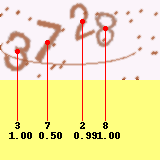

# Captcha Recognition

## 介绍

简单的基于关键点识别的验证码识别，适用于新手教学。

## 安装

```
pip install -r requirements.txt
```

Python>=3.5, PyTorch>1.0大概就没问题。

## 使用

### 数据生成

```
python gen_data.py
```

生成的数据是4位数字，图片大小是80x160。存放于`dataset/images`（图片）和`dataset/labels`（标签）。80%数据用于训练，20%用于验证。

标签格式为一行表示一个字符的信息：`<char> <x1> <y1> <x2> <y2>`。坐标为字符的左上角和右下角，绝对坐标。例：`2 45.32 68.00 78.50 97.00`。

### 训练

```
python train.py
```

训练集4000张图片。如果有GPU，训练时间不到5分钟。使用CPU的情况下，i5-8265U实测25分钟左右。

简单的CNN验证集精度在90%左右。

### 预测

```
# 输出四位预测结果
python predict.py --img dataset/images/2783.png
# 将预测结果表示成图片
python predict.py --img dataset/images/4393.png --detail results/detail.png
```


